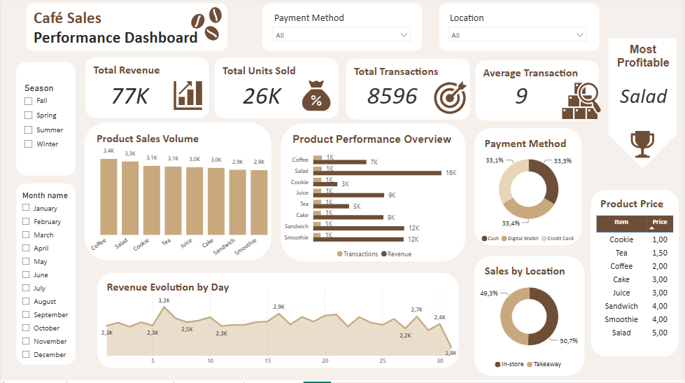

# Café Sales — Data Cleaning & Analysis

## Overview
This project involves cleaning a messy, real-world-style café sales dataset and performing exploratory analysis to uncover business insights, using MySQL Workbench. The next phase will connect the cleaned data to Power BI for visualization.

## Dataset
- **Source:** Synthetic café sales transaction data
- **Records:** ~10,000 transactions
- **Columns:** Transaction ID, Item, Quantity, Price Per Unit, Total Spent, Payment Method, Location, Transaction Date

## Tools Used
- MySQL Workbench (data cleaning & analysis)
- Power BI (visualization — iteractive dashboard)

## Project Structure
├── README.md
└── sql/
    ├── 01_data_cleaning_queries.sql
    └── 02_Analysing.sql

## Data Cleaning Process
The raw dataset contained missing values, "ERROR"/"UNKNOWN" placeholders, and inconsistent entries across several columns. Key steps included:

- **Total Spent:** Recalculated using `Quantity × Price Per Unit` where missing or invalid
- **Item:** Inferred from `Price Per Unit` mapping; ambiguous cases (items sharing the same price) labeled transparently rather than guessed
- **Payment Method & Location:** Standardized null/error values to `"UNKNOWN"` for consistent filtering
- **Transaction Date:** Removed rows with invalid or missing dates

Full queries available in `sql/01_data_cleaning.sql`.

## Key Findings
- **Demand is highly consistent year-round** — revenue and transaction volume show minimal variation across seasons and days of the week, suggesting stable customer demand rather than seasonal spikes
- **Volume ≠ Revenue:** Coffee is the most frequently sold item, but Salad generates the highest total revenue due to its higher price point — a classic case where popularity and profitability diverge
- Items like Sandwich and Smoothie offer the best balance between volume and revenue contribution

Full queries available in `sql/02_data_analysis.sql`.

## Dashboard Preview

The dashboard consolidates all findings into a single-page view, featuring KPI cards, 
product performance charts, revenue trend by day, and operational breakdowns by location 
and payment method. Interactive slicers allow filtering by Season, Month, Payment Method, 
and Location.

## Next Steps
- Add Python analysis to complement SQL findings
- Publish dashboard to Power BI Service for online viewing

## Author
Juan Ferreira — Junior Data Analyst Portfolio Project
